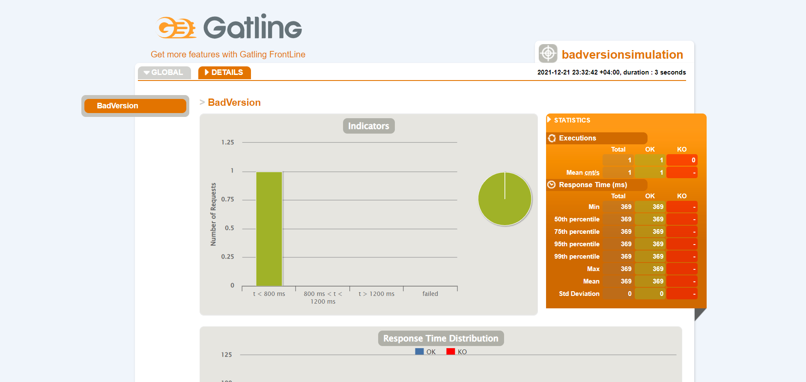

# Load test results 1

Results of the first load testing that involves 250 requests per second during 40 seconds:

## Test environment specifications
###### OS
Windows 10 Home 21H1
###### Processor
Intel(R) Core(TM) i7-4700HQ CPU @ 2.40GHz   2.39
###### RAM
16.0 GB
